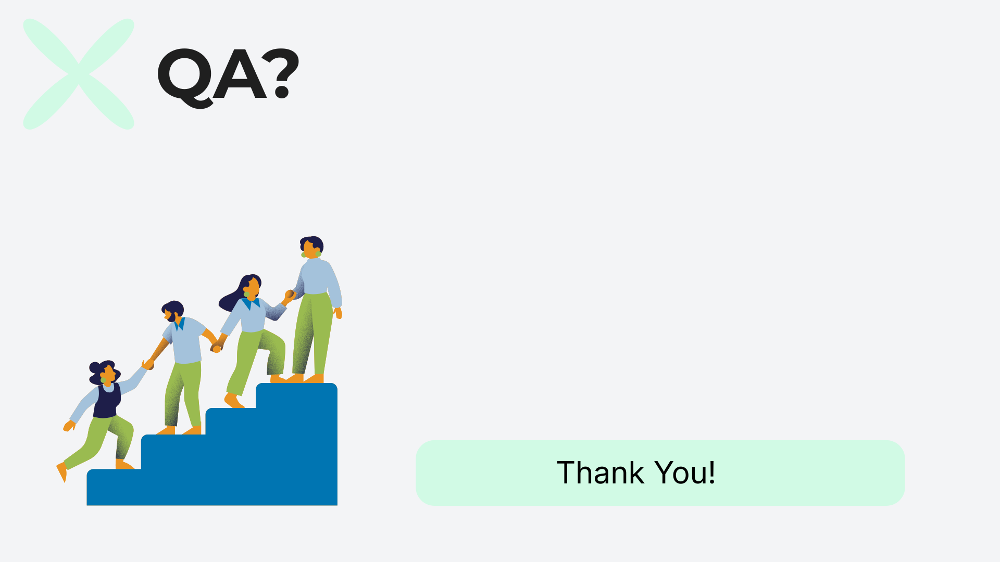

**1. Project Overview**
Google Play hosts millions of apps across different categories. This project analyses app performance to identify market opportunities, understand user preferences, and provide recommendations for developers using Excel, SQL, and Tableau.  

**2.Problem Statement**
 

**3. Hypothesis**
 

**4. Business Questions**
2.1 Which categories attract the highest number of installs?
2.2 Do paid apps outperform free apps?
2.3 Which categories have the highest customer ratings?
2.4 Which markets appear saturated?
2.5 Which app categories represent the best investment opportunities?

**5. Dataset**
Source: ([Kaggle: Google Play Store App Data](https://www.kaggle.com/datasets/whenamancodes/play-store-apps))
Number of rows: 10,357
Number of columns: 14
 

**6. Tech Stack**
Excel,
SQL,
Tableau,
GitHub  

**7. Project Workflow**
Raw Data - Excel Cleaning - SQL Database - Business Analysis - Tableau Dashboard -  Business Recommendations  

**8. Dashboard Preview**
To visit the live layout ([https://tableau.com](https://public.tableau.com/app/profile/basant.pandey/viz/tableau_17857535985400/Dashboard1))
 

**9. Key Insight & Business Recommendations**
 

**10. Key Learning & Next Steps**

