**1. Project Overview**
Google Play hosts millions of apps across different categories. This project analyses app performance to identify market opportunities, understand user preferences, and provide recommendations for developers using Excel, SQL, and Tableau.  

**2.Problem Statement**
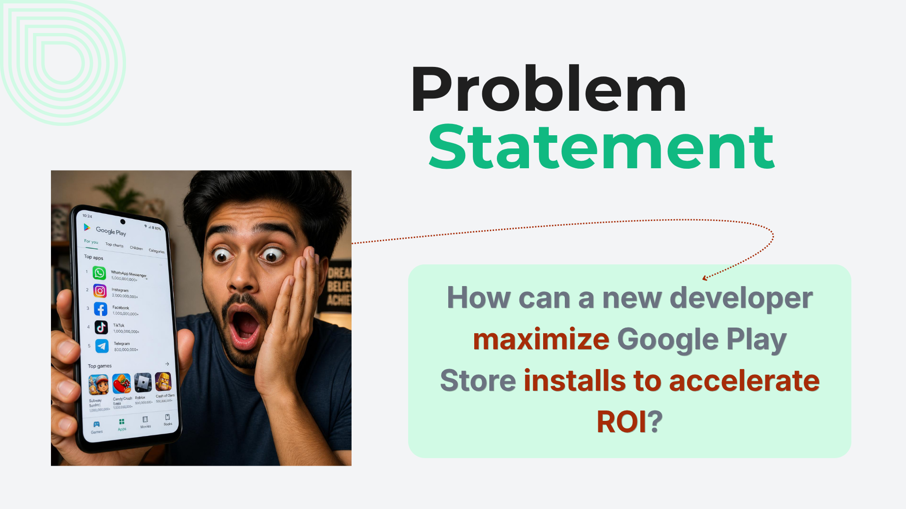 

**3. Hypothesis**
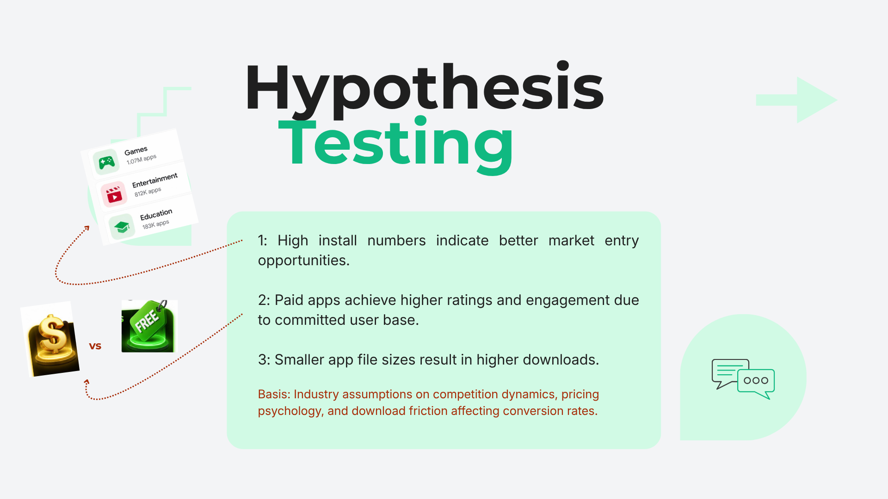 

**4. Dataset**
Source: ([Kaggle: Google Play Store App Data](https://www.kaggle.com/datasets/whenamancodes/play-store-apps))  
Number of rows: 10,357  
Number of columns: 14
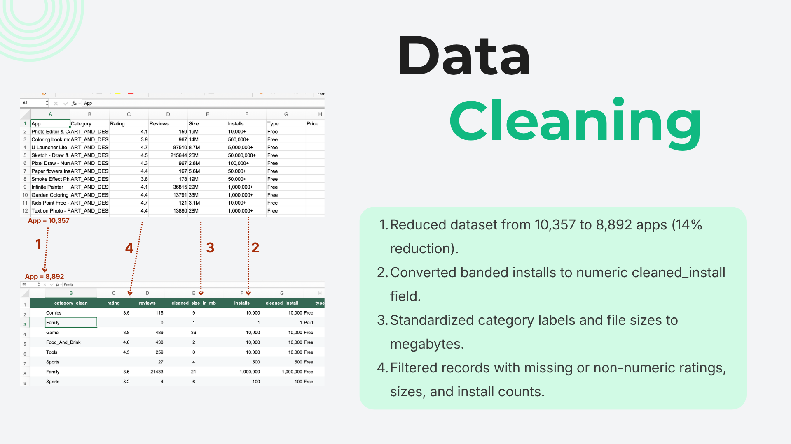 

**5. Tech Stack**
Excel,
SQL,
Tableau,
GitHub 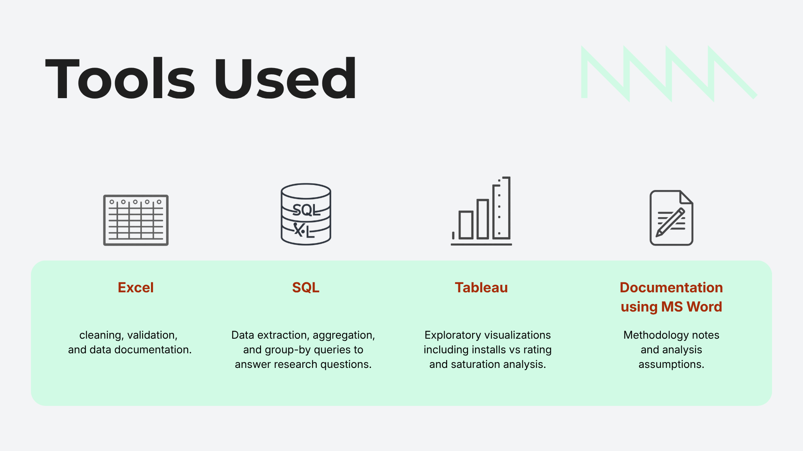 

**6. Business Questions**
2.1 Which categories attract the highest number of installs?
2.2 Do paid apps outperform free apps?
2.3 Which categories have the highest customer ratings?
2.4 Which markets appear saturated?
2.5 Which app categories represent the best investment opportunities?

**7. Hypothesis 1: Does high install numbers indicate better market entry opportunities?**
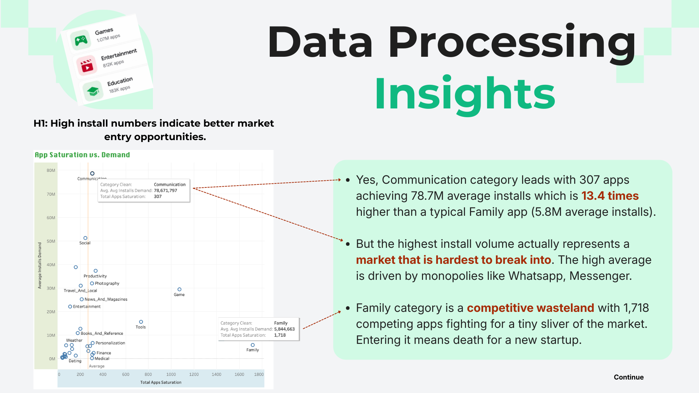 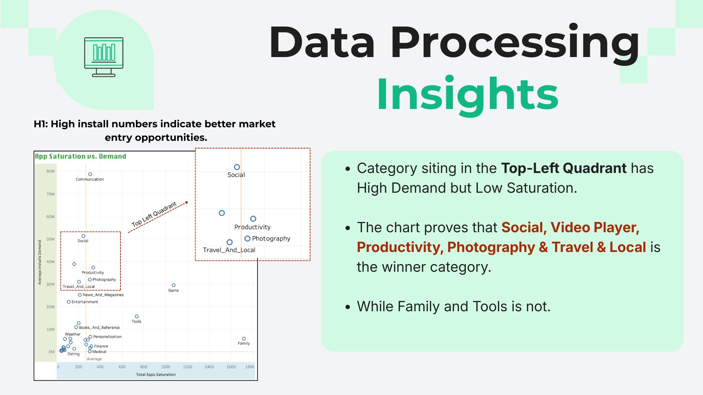 

**8. Hypothesis 2: Does paid apps achieve higher ratings and engagement due to committed user base?**
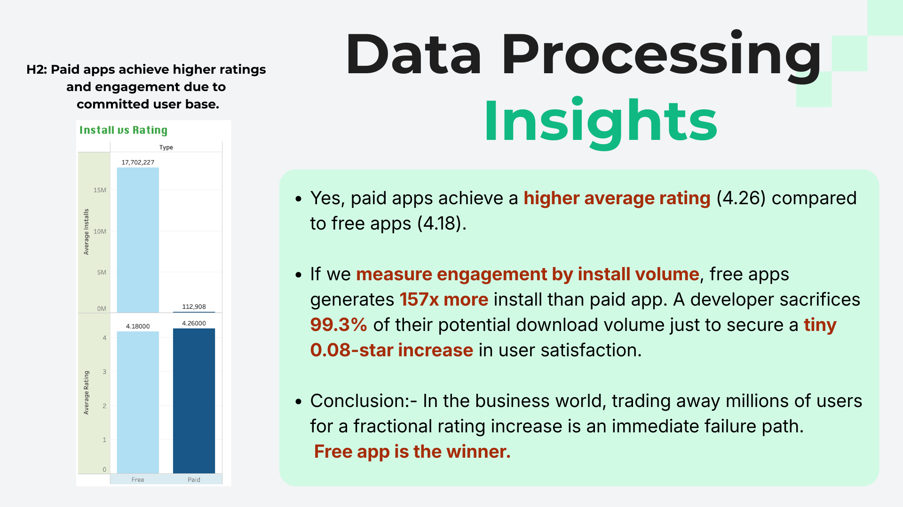 

**9. Hypothesis 3: Does smaller app file sizes result in higher downloads?**
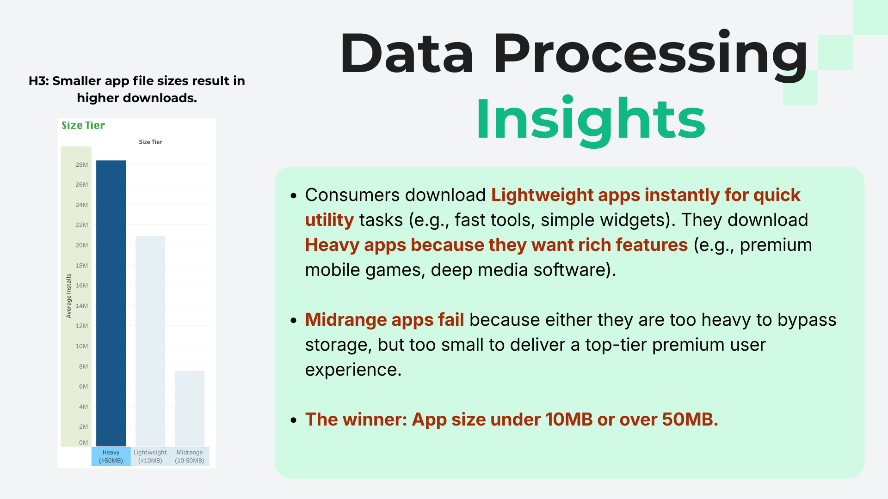 

**10. Dashboard Preview**
To visit the live layout ([https://tableau.com](https://public.tableau.com/app/profile/basant.pandey/viz/tableau_17857535985400/Dashboard1))
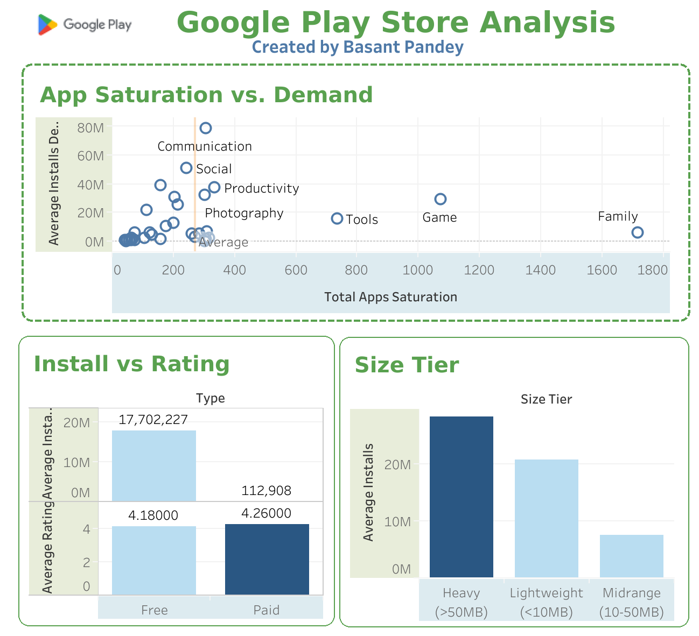 

**11. Key Insight & Business Recommendations**
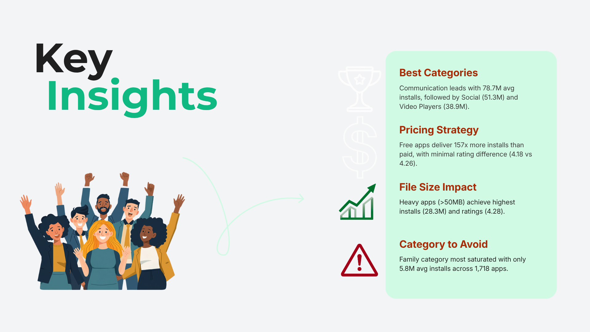 
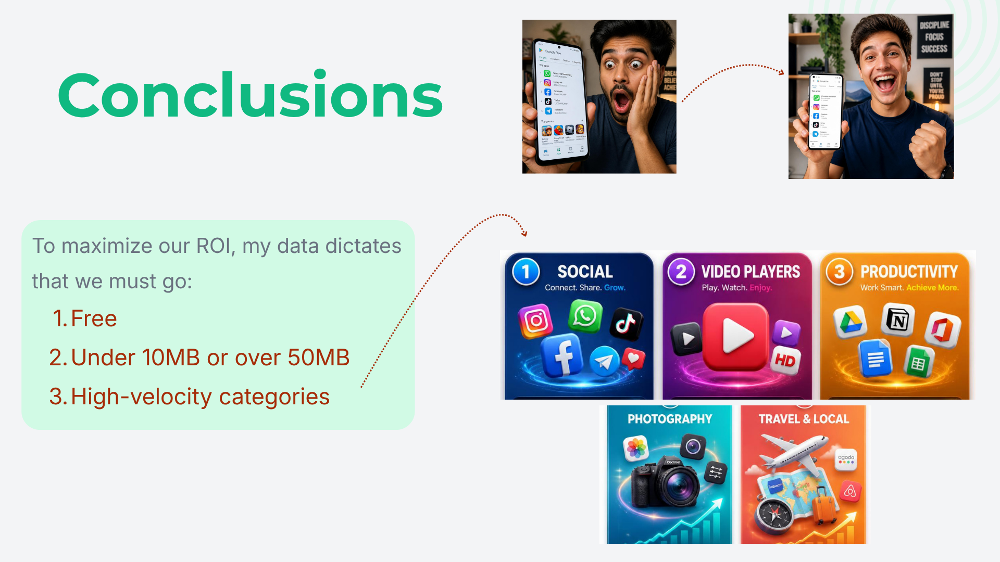

**12. Key Learning & Next Steps**
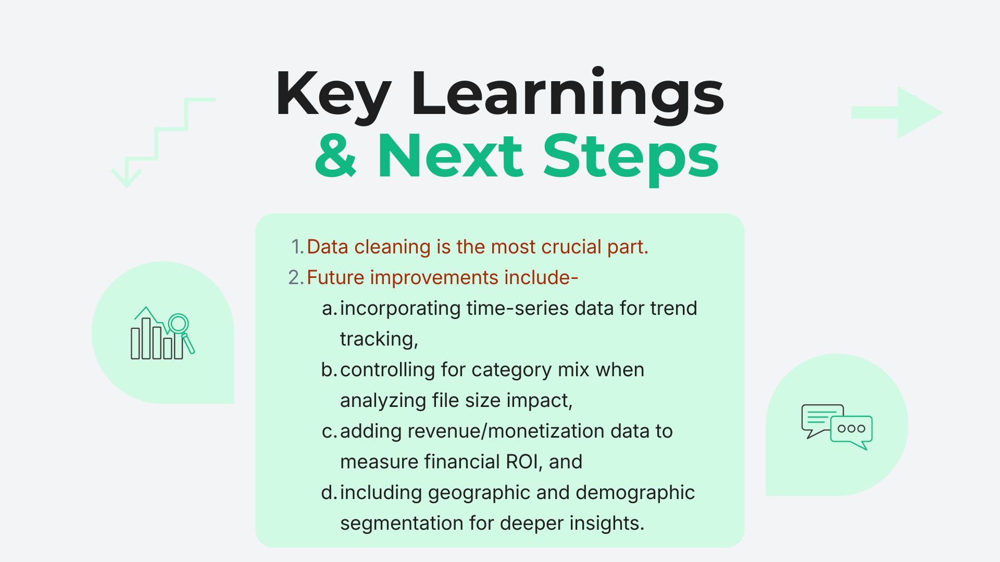

